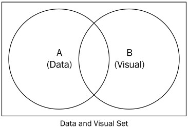
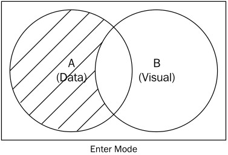

<!-- MarkdownTOC -->

- [D3.js系列](#d3js%E7%B3%BB%E5%88%97)
	- [基本介绍](#%E5%9F%BA%E6%9C%AC%E4%BB%8B%E7%BB%8D)
	- [特点](#%E7%89%B9%E7%82%B9)
	- [可视化项目的一般特点](#%E5%8F%AF%E8%A7%86%E5%8C%96%E9%A1%B9%E7%9B%AE%E7%9A%84%E4%B8%80%E8%88%AC%E7%89%B9%E7%82%B9)
	- [主要功能模块](#%E4%B8%BB%E8%A6%81%E5%8A%9F%E8%83%BD%E6%A8%A1%E5%9D%97)
	- [D3.js代码风格](#d3js%E4%BB%A3%E7%A0%81%E9%A3%8E%E6%A0%BC)
	- [更新Update、插入Enter、退出Exit模式](#%E6%9B%B4%E6%96%B0update%E3%80%81%E6%8F%92%E5%85%A5enter%E3%80%81%E9%80%80%E5%87%BAexit%E6%A8%A1%E5%BC%8F)
	- [动画](#%E5%8A%A8%E7%94%BB)
	- [归一化 normalization](#%E5%BD%92%E4%B8%80%E5%8C%96-normalization)
	- [比例尺 scale](#%E6%AF%94%E4%BE%8B%E5%B0%BA-scale)
		- [d3.scaleLinear 线性比例尺](#d3scalelinear-%E7%BA%BF%E6%80%A7%E6%AF%94%E4%BE%8B%E5%B0%BA)
		- [d3.scalePow 指数比例尺](#d3scalepow-%E6%8C%87%E6%95%B0%E6%AF%94%E4%BE%8B%E5%B0%BA)
		- [d3.scaleSqrt 平方根比例尺](#d3scalesqrt-%E5%B9%B3%E6%96%B9%E6%A0%B9%E6%AF%94%E4%BE%8B%E5%B0%BA)
		- [d3.scaleLog 对数比例尺](#d3scalelog-%E5%AF%B9%E6%95%B0%E6%AF%94%E4%BE%8B%E5%B0%BA)
		- [d3.scaleQuantize 量化比例尺](#d3scalequantize-%E9%87%8F%E5%8C%96%E6%AF%94%E4%BE%8B%E5%B0%BA)
		- [d3.scaleQuantile 分位比例尺](#d3scalequantile-%E5%88%86%E4%BD%8D%E6%AF%94%E4%BE%8B%E5%B0%BA)
		- [d3.scaleThreshold 阈值比例尺](#d3scalethreshold-%E9%98%88%E5%80%BC%E6%AF%94%E4%BE%8B%E5%B0%BA)
		- [d3.scaleIdentity 等价比例尺](#d3scaleidentity-%E7%AD%89%E4%BB%B7%E6%AF%94%E4%BE%8B%E5%B0%BA)
		- [d3.scaleOrdinal 序数比例尺](#d3scaleordinal-%E5%BA%8F%E6%95%B0%E6%AF%94%E4%BE%8B%E5%B0%BA)
		- [d3.scaleTime 时间比例尺](#d3scaletime-%E6%97%B6%E9%97%B4%E6%AF%94%E4%BE%8B%E5%B0%BA)
		- [d3.scaleBand 序数段比例尺](#d3scaleband-%E5%BA%8F%E6%95%B0%E6%AE%B5%E6%AF%94%E4%BE%8B%E5%B0%BA)
		- [d3.scalePoint 序数点比例尺](#d3scalepoint-%E5%BA%8F%E6%95%B0%E7%82%B9%E6%AF%94%E4%BE%8B%E5%B0%BA)
		- [d3.scaleImplicit](#d3scaleimplicit)
		- [d3.scaleSequential 顺序比例尺](#d3scalesequential-%E9%A1%BA%E5%BA%8F%E6%AF%94%E4%BE%8B%E5%B0%BA)
	- [插值器 interpolation](#%E6%8F%92%E5%80%BC%E5%99%A8-interpolation)
	- [参考](#%E5%8F%82%E8%80%83)

<!-- /MarkdownTOC -->


<a name="d3js%E7%B3%BB%E5%88%97"></a>
# D3.js系列

> 版本：`4.10.0`

<a name="%E5%9F%BA%E6%9C%AC%E4%BB%8B%E7%BB%8D"></a>
## 基本介绍

> D3(Data-Driven Documents)，数据驱动文档，是一个javascript数据可视化库，是ProtoVis的改进，作者是 [Mike Bostock](https://bost.ocks.org/mike/)  
> D3.js以数据驱动的编程方式，将复杂的程序逻辑代码转换为数据，以使得程序更好的开发和维护。  
> 对于复杂的可视化项目，大部分类库都是以直接操作图形API的方式开发， D3.js注重的是数据转换，而不是图形表现，是以Web标准的HTML，SVG，CSS等来处理视图部分，
> 以设计者的创意自己实现图形界面。   

<a name="%E7%89%B9%E7%82%B9"></a>
## 特点

- 数据绑定（DOM）
> 将数据绑定DOM上，方便二者相互转换操作，比如：根据当前的DOM获取原始数据，经计算转换后用于绘制其它图形，反过来，也可以根据数据过滤DOM

- 转换数据与图形分离
> 一般的可视化图（ECharts.js，Highchatrs.js等）API，是输入数据直接绘制图形的，但D3是将输入数据进行计算转换成图形所需要的数据，开发者自己绘制图形  
> D3这种方式看似比较麻烦，但对于复杂的图形有更定制化需求时，会提高很大的自由度

- 提供大量的布局和可视化效果案例
- API简洁，不依赖浏览器以及其它库，方便集成到第三方库或框架中，使得D3融入整个生态体系，开发也变得灵活
- 能够帮助实现个性化复杂的可视化图形，但学习曲线较高，在没有深入理解D3.js的数据驱动为核心思路时，很难把需求转换为对应的API来表达效果

<a name="%E5%8F%AF%E8%A7%86%E5%8C%96%E9%A1%B9%E7%9B%AE%E7%9A%84%E4%B8%80%E8%88%AC%E7%89%B9%E7%82%B9"></a>
## 可视化项目的一般特点
- 交互性强
- 大量可视化图形算法
- 细粒度的图形操作
- 个性化需求多，复用性差
- ...

<a name="%E4%B8%BB%E8%A6%81%E5%8A%9F%E8%83%BD%E6%A8%A1%E5%9D%97"></a>
## 主要功能模块
- 选择器 selector  

> 以querySelector和querySelectorAll方法进行DOM节点的选择

- 数据绑定 data  

> 将数据添加到DOM的`__data__`属性上  

- 动画变换  transition  

> 通过封装的schedule和插值器interpolate计算出中间值，实现动画过渡效果  

- 数组Arrays、集合Collections的一些扩展方法
- 通用交互事件（Brushes，Dragging，Zooming）  

> 使用selection.on方法addEventListener多个事件，并借助dispatch模块，生成listeners，主要是基于以下事件进行封装：  
> Brush：selection.on("mousedown.brush, mousemove.brush, mouseup.brush")  
> Drag：selection.on("mousedown.drag, mousemove.drag, mouseup.drag")  
> Zoom：selection.on("wheel.zoom")  

- 图形及布局计算（Arcs, Pies, Lines, Areas，Stacks，Forces，Geographies等）
- 一些通用计算和辅助模块（Dispatches，Interpolators，Scales，Time Format，XHR，Queues等）

<a name="d3js%E4%BB%A3%E7%A0%81%E9%A3%8E%E6%A0%BC"></a>
## D3.js代码风格

- 链式调用

> 和jQuery的API类似，每个函数执行后，返回当前作用的对象; attr，style等调用参数数量<2时，为获取当前属性或样式值，否则为赋值操作

- 函数参数  

> d：datum，i：index，this：当前DOM元素，例如：`.attr('x', function(d, i){console.log(d, i, this)})`  

- 函数默认参数  

> 例如：`.attr('x', setX)`，相当于 `.attr('x', function(d, i){return setX(d, i)})`

<a name="%E6%9B%B4%E6%96%B0update%E3%80%81%E6%8F%92%E5%85%A5enter%E3%80%81%E9%80%80%E5%87%BAexit%E6%A8%A1%E5%BC%8F"></a>
## 更新Update、插入Enter、退出Exit模式

```js
var doms = root.selectAll("div").data([1,2,3]);
doms.text((d) => d);
doms.enter().append("div").text((d) => d);
doms.exit().remove();
```
> 数据绑定方法：data方法是绑定元素集合，datum方法是绑定单个元素

  

更新Update模式 **A∩B**  
  

进入Enter模式 **A\B**  
  

退出Exit模式 **B\A**  
  

- 数据绑定机制  


<a name="%E5%8A%A8%E7%94%BB"></a>
## 动画

- 工作方式

> selection.transition，指定选择元素的动画方案  
> transition.ease，指定动画缓动函数   
> transition.duration，指定动画时长  
> transition.on，监听动画，start,end,interrupt对应动画开始，结束，中断3种事件
> tween,styleTween,attrTween，指定css样式和DOM属性的插值动画函数

<a name="%E5%BD%92%E4%B8%80%E5%8C%96-normalization"></a>
## 归一化 normalization  
> 将数据统一映射为[0,1]的区间上，使得原始数据转化为无量纲的数值  

为什么要归一化  

- 简化计算  

> 将不同量纲的数据统一成无量纲数据，计算后，再转换为相应的量纲数据  

<a name="%E6%AF%94%E4%BE%8B%E5%B0%BA-scale"></a>
## 比例尺 scale
> scale就是可以进行特殊计算的函数，在线性比例尺中一般使用插值的方法计算  
> domain: 定义域，即原始数据集合  
> range: 值域，即输出数据集合  

> ** 以下计算步骤，只作演示，不包含所有情况 **

<a name="d3scalelinear-%E7%BA%BF%E6%80%A7%E6%AF%94%E4%BE%8B%E5%B0%BA"></a>
### d3.scaleLinear 线性比例尺
> 说明：线性比例尺使用插值器来计算，domain元素必须为数值类型或是字符型数字  
> 默认插值器包括：字符串插值、颜色插值、数组插值、对象插值、数字插值，根据range元素类型自动执行相应的插值器  
> domain数组长度 ≥ 2，range数组长度 ≥ 2，其中当domain.length > 2时，元素要从小到大排序，否则无法按domain范围到range范围输出

默认：  
domain:[0,1]  
range:[0,1]  
输出：x(==x)，输入数字，即输出为相应的数值，不能转换为数字时，输出为NaN  

例如： 

```js
var scale = d3.scaleLinear().domain([0,100,200]).range([10,20,30]);
scale(150) //输出25

var scale = d3.scaleLinear().domain([0,200,100]).range([10,20,30]);
scale(150)//输出17.5
```

插值器计算方法（domain和range长度为2时，`0 ≤ t ≤ 1`）： 

> 当domain和range元素都是数字时，输出：`a * (1 - t) + b * t`  
> 其中，`t=(x-domain[0])/(domain[1]-domain[0])`，`a=range[0]`，`b=range[1]`  
> 当domain[0]>domain[1]时，domain和range执行reverse()  

> 当range元素为字符串：  
>> 针对数字部分进行上述计算（没有数字部分输出为range[1]内容），保留字符串(不参与插值)  
>> 例如：`var scale = d3.scaleLinear().domain([0,100]).range(["10px","20px"]); scale(50) //输出15px`    

> 当range元素为颜色值（rgb,hsl,hcl,lab），分别按相应的颜色模式进行插值    

> range元素为数组且数组元素包含数字时，输出时，保留数组形式并插值计算数组内元素，当range元素各数组长度不一致时，只插值计算相同下标内元素
>>例如：  
>> `var scale = d3.scaleLinear().domain([0,100]).range([[10],[20]]); scale(50) // [15]`;  
>> `var scale = d3.scaleLinear().domain([0,100]).range([[10,30],[20]]); scale(50) // [15]`;  
>> `var scale = d3.scaleLinear().domain([0,100]).range([[10,30],[20,40]]); scale(50) // [15,35]`;  

> range元素为对象时，插值计算对象内元素  
> 例如：`var scale = d3.scaleLinear().domain([0,100]).range([{"width":10},{"width":20}]);scale(50) // {width: 15}`  
> 应用场景：趋势统计类  


<a name="d3scalepow-%E6%8C%87%E6%95%B0%E6%AF%94%E4%BE%8B%E5%B0%BA"></a>
### d3.scalePow 指数比例尺  
> 基于d3.scaleLinear，默认指数为1，将domain各元素和输入值进行指数计算后（保留+-符号），进行线性插值，domain元素必须为数字，否则输出NaN  
> 例如：  

>> `var scale = d3.scalePow().domain([0,100]).range([10,20]).exponent(2); scale(50) // 12.5`  
>> 等于：  
>> `var scale = d3.scaleLinear().domain([Math.pow(0,2), Math.pow(100,2)]).range([10,20]); scale(Math.pow(50,2))`  

>> `var scale = d3.scalePow().domain([0,-100]).range([10,20]).exponent(2); scale(50) // 7.5`  
>> 等于：  
>> `var scale = d3.scaleLinear().domain([Math.pow(0,2), -Math.pow(100,2)]).range([10,20]); scale(Math.pow(50,2))`  

> 应用场景：圆面积变化  

<a name="d3scalesqrt-%E5%B9%B3%E6%96%B9%E6%A0%B9%E6%AF%94%E4%BE%8B%E5%B0%BA"></a>
### d3.scaleSqrt 平方根比例尺  
> 基于d3.scalePow，只是简化了exponent(0.5)  
> 示例：  

>> `var scale = d3.scaleSqrt().domain([0,100]).range([10,20]); scale(50) // 17.071067811865476`  
>> 等于：  
>> `var scale = d3.scaleLinear().domain([Math.pow(0,0.5), Math.pow(100,0.5)]).range([10,20]); scale(Math.pow(50,0.5))`  

> 可以更改exponent（建议官方禁用，以保持sqrt的含义）
>> `var scale = d3.scaleSqrt().domain([0,100]).range([10,20]).exponent(3); scale(50) // 11.25`  
>> 等于：  
>> `var scale = d3.scaleLinear().domain([Math.pow(0,3), Math.pow(100,3)]).range([10,20]); scale(Math.pow(50,3))`  

> 应用场景：根据圆面积反应数据变化

<a name="d3scalelog-%E5%AF%B9%E6%95%B0%E6%AF%94%E4%BE%8B%E5%B0%BA"></a>
### d3.scaleLog 对数比例尺  
> 基于d3.scaleLinear，将domain各元素和输入值进行对数操作后进行线性插值，注意domain各元素>0，否则输出NaN  
> 示例：  
```js
var scale = d3.scaleLog()
	.domain([10, 1000])
	.range([0, 10])
	.base(10);
scale(10); // 0
scale(500); // 8.494850021680092
scale(1000); // 10
```
> 计算步骤：  
> domain = [Math.log(10), Math.log(1000)]  
> scale(10) = d3.scaleLinear().domain([Math.log(10), Math.log(1000)]).range([0, 10])(Math.log(10)) = 0  
> 应用场景：以对数变化的数据  

<a name="d3scalequantize-%E9%87%8F%E5%8C%96%E6%AF%94%E4%BE%8B%E5%B0%BA"></a>
### d3.scaleQuantize 量化比例尺  
> 说明：domain各元素必须为数值类型，domain数组长度 ≥ 2,range数组长度 ≥ 2，其中domain在计算中只使用了domain[0]和domain[1]2个值，定义域是连续的，值域是离散的  
> 默认:  
> domain:[0,1]  
> range:[0,1]  
> 输出:  
> range[index]  
> index有效值为0～range.length-1  
> index=Math.floor((输入值-domain[0]) * range.length/(domain[domain.length-1]-domain[0]))   
> 示例：
```js
var scale = d3.scaleQuantize()
  .domain([0, 100])
  .range(['A', 'B', 'C', 'D']);
scale(-1); // A, index = 0
scale(0); // A, index = 0
scale(10); // A, index = 0
scale(30); // B, index = 1
scale(50); // C, index = 2
scale(90); // D, index = 3
scale(110); // D, index = 3
```
> 计算步骤：  
> domain被分为：[0, 25, 50, 75, 100]，`(100 - 0) / 4 = 25`  
> x < 0 对应 'A'  
> 0 ≤ x < 25 对应 'A'  
> 25 ≤ x < 50 对应 'B'  
> 50 ≤ x < 75 对应 'C'  
> 75 ≤ x < 100 对应 'D'  
> x ≥ 100 对应 'D'  
> 应用场景：基于值域的数量等分定义域，形成分段的阈值映射值域  

<a name="d3scalequantile-%E5%88%86%E4%BD%8D%E6%AF%94%E4%BE%8B%E5%B0%BA"></a>
### d3.scaleQuantile 分位比例尺  
> 默认为空  
> domain各元素必须为数值类型，正序，非数值类型将过滤，使用d3.quantile将domain生成新的分位值数组(length = range.length - 1)，
> 使用bisect在分位值数组中找到输入值所在的插入点位置index  
  输出: range[index]  
> 示例：  
```js
var scale = d3.scaleQuantile()
  .domain([0, 100])
  .range(['A', 'B', 'C', 'D']);
scale(50); // C
```
> 计算步骤：  
> 1. newDomain.length = range.length - 1; i = 1;  
> 2. newDomain: [d3.quantile([0,100],i/length), d3.quantile([0,100],(i + 1)/length), d3.quantile([0,100],(i + 2)/length)]  
> 3. index = d3.bisect(newDomain, 50) // 注：d3.bisect = d3.bisectRight  
> 4. range[index]  
> 应用场景：同d3.scaleQuantize，但domain.length ≥ 2

<a name="d3scalethreshold-%E9%98%88%E5%80%BC%E6%AF%94%E4%BE%8B%E5%B0%BA"></a>
### d3.scaleThreshold 阈值比例尺  
> 默认:  
> domain:[0.5]  
> range[0,1]  
> 输出：0(==0)，1（>=1）  
> 使用bisect查找输入值在domain中的插入的位置index，输出为range[index]，通常range元素数量要比domain多一个  
> 示例：  
```js
var scale = d3.scaleThreshold()
  .domain([0, 100, 200])
  .range(['A', 'B', 'C', 'D']);
scale(50); // B
```
> 计算步骤：  
> n = Math.min(domain.length, range.length - 1)  
> index = d3.bisect(domain, x, 0, n)  
> range[index]  
> 应用场景：根据输入值在domain的右侧插入点位置来确定输出，注：只有输入值小于domin各元素值时，输出值为range[0]  

<a name="d3scaleidentity-%E7%AD%89%E4%BB%B7%E6%AF%94%E4%BE%8B%E5%B0%BA"></a>
### d3.scaleIdentity 等价比例尺  
> 默认:  
> domain:[0,1]  
> 输出：x(==x)，输入数字，即输出为相应的数值，不能转换为数字时，输出为NaN  
  
> 设置domain，作用只是将domain元素中字符型数字转换为数值型  
> 输出时，为x(==x)，与domain无关  
> 示例：  
```js
var scale = d3.scaleIdentity();
scale(10); // 10
scale('10'); // 10
```
> 应用场景：字符型数字与数值互换  

<a name="d3scaleordinal-%E5%BA%8F%E6%95%B0%E6%AF%94%E4%BE%8B%E5%B0%BA"></a>
### d3.scaleOrdinal 序数比例尺  
> 默认：  
> domain:[]  
> range:[]  
> 输出为空  
> 生成domain元素为键名，所在的索引(index + 1)为键值的map对象  
> 当输入值不在map对象中，将其添加到domain中，
> mindex = (index - 1) % range.length，取模是为了控制在range中取值  
> 输出: range[mindex]  
> 示例：  

```js
var scale = d3.scaleOrdinal()
  .domain(['A', 'B', 'C'])
  .range(['#fff', '#000', '#999']);
scale('A'); // '#fff'
scale('C'); // '#999'
scale('D'); // '#fff'，添加到domain中，计算 scale.range()[(scale.domain().length - 1) % scale.range().length]
scale.domain(); // 查看domain： ['A', 'B', 'C', 'D'];
```

> 计算步骤：  
> 将domain元素转换为d3.map对象（[{'A':1},{'B':2},{'C':3}]）  
> 查找输入值在map的index = map.get(x)，输入值不在map内时，map.set(x, domain.length)  
> range[(index - 1) % range.length]  
> 应用场景：分类映射   

<a name="d3scaletime-%E6%97%B6%E9%97%B4%E6%AF%94%E4%BE%8B%E5%B0%BA"></a>
### d3.scaleTime 时间比例尺  
> 基于d3.scaleLinear，只是将domain格式化为日期类型（输入值也必须为日期类型，数值类型时输出range[0]，其它类型时输出NaN），
> 当domain元素不是日期类型的值时，输入日期输出为当前时间戳，输入数字类型时，按线性比例输出。  
> 示例：  
```js
var scale = d3.scaleTime()
  .domain([new Date('2017-12-10 00:00:00'), new Date('2017-12-20 00:00:00')])
  .range([0, 100]);
scale(new Date('2017-12-10 00:00:00')); // 0
scale(new Date('2017-12-20 00:00:00')); // 100

scale.domain(['2017-12-10 00:00:00', '2017-12-20 00:00:00']); // 日期字符格式
scale(new Date('2017-12-10 00:00:00')); // NuN
scale('2017-12-10 00:00:00'); // NuN

scale.domain([1512835200000, '1513699200000']); // 时间戳格式，数字或字符型都可以
scale(new Date('2017-12-10 00:00:00')); // 0
scale(1512835200000); // 0

```

> 计算步骤：  
> domain = [new Date(+domain[0]), new Date(+domain[1])]  
> 按数字插值计算  
> 应用场景：时间轴  

** 4.x增加的比例尺 **   

<a name="d3scaleband-%E5%BA%8F%E6%95%B0%E6%AE%B5%E6%AF%94%E4%BE%8B%E5%B0%BA"></a>
### d3.scaleBand 序数段比例尺  
> 默认：range:[0,1], paddingInner = 0, paddingOuter = 0, align = 0.5  
> 基于d3.scaleOrdinal
> 计算step = (range[1] - range[0]) / Math.Max(1,(domain().length - paddingInner + paddingOuter * 2))  
> 根据range划分出domain.length份的values  
> bandwidth = step * (1 - paddingInner)  
> 输出：domain[i] -> values[i]  
> 示例：  
```js
var scale = d3.scaleBand()
	.domain(['A','B','C'])
	.rangeRound([0, 100])
	.padding(0.1)
	.align(1);
scale('A'); // 7
scale('C'); // 71
```
> 计算步骤：  
> paddingInner = paddingOuter = Math.max(0, Math.min(1, padding)) = 0.1  
> step = (100 - 0) / Math.max(1, (3 - 0.1 + 0.1 * 2)) = 32.25806451612903  
> step = Math.floor(step) = 32  
> start = range[0] = 0  
> start = Math.round(start)  
> start += (range[1] - start - step * (domain.length - paddingInner)) * align = (100 - 0 - 32 * (3 - 0.1)) * 1 = 7.200000000000003  
> d3.range[domain.length].map(function(i) { return start + step * i; }) = [7.200000000000003,39.2,71.2]  
> ordinalRange = [7,39,71]  
> **scale = d3.scaleOrdinal().domain(['A', 'B', 'C']).range([7,39,71])**;  
> range.length = 3  
> 'A' -> 1, ordinalRange[(1 - 1) % 3] = 7   
> 'C' -> 3, ordinalRange[(3 - 1) % 3] = 71   
> 应用场景：将分类数据平均分配到range范围内  

<a name="d3scalepoint-%E5%BA%8F%E6%95%B0%E7%82%B9%E6%AF%94%E4%BE%8B%E5%B0%BA"></a>
### d3.scalePoint 序数点比例尺  
> 默认：range:[0,1], **paddingInner = 1** , paddingOuter = 0, align = 0.5  
> 基于d3.scaleBand  
> step = (range[1] - range[0]) / (domain().length - 1 + paddingOuter * 2)    
> 根据range划分出domain.length份的values  
> bandwidth = step * (1 - paddingInner) = 0
> 输出：domain[i] -> values[i]  
> 示例：  
```js
var scale = d3.scalePoint()
	.domain(['A','B','C'])
	.rangeRound([0, 100])
	.padding(0.1) // paddingOuter
	.align(1);
scale('A'); // 10
scale('C'); // 100
```
> 计算步骤：  
> paddingOuter = 0.1  
> step = (100 - 0) / (3 - 1 + 0.1 * 2) = 45.454545454545454545454545454545  
> step = Math.floor(step) = 45  
> start = 0  
> start += (range[1] - start - step * (domain.length - paddingInner)) * align = (100 - 0 - 45 * (3 - 1)) * 1 = 10  
> d3.range[domain.length].map(function(i) { return start + step * i; }) = [10, 55, 100]  
> ordinalRange = [10, 55, 100]  
> **scale = d3.scaleOrdinal().domain(['A', 'B', 'C']).range([10, 55, 100])**;  
> range.length = 3  
> 'A' -> 1, range[(1 - 1) % 3] = 0  
> 'C' -> 3, range[(3 - 1) % 3] = 100  
> 应用场景：分类，但range元素数量只能是2个 

<a name="d3scaleimplicit"></a>
### d3.scaleImplicit   
> 在d3.scaleOrdinal中用于unknown值的判断，当x不在domain中，并且unknown !== d3.scaleImplicit时，直接返回unknown值  
> 示例：  
```js
var scale = d3.scaleOrdinal()
  .domain(['A', 'B', 'C'])
  .range(['#fff', '#000', '#999'])
  .unknown('error');
scale('D'); // "error"
scale.unknown(d3.scaleImplicit);
scale('D'); // "#fff"
```
> 应用场景：在使用d3.scaleOrdinal中，直接将特殊值当作返回值使用  

<a name="d3scalesequential-%E9%A1%BA%E5%BA%8F%E6%AF%94%E4%BE%8B%E5%B0%BA"></a>
### d3.scaleSequential 顺序比例尺  
> 基于d3.scaleLinear  
> 默认 domain:[0, 1]  
> 必须先指定interpolator，并且domain必须是2个数值类型元素，简单地将 t = (x - domain[0]) / (domain[1] - domain[0])用于插值器中  
> 示例：  
```js
var scale = d3.scaleSequential()
	.domain([1,10])
	.interpolator(function(t){return 'rgb(' + t * 255 + ',0,0)'});
scale(1); // "rgb(0,0,0)"
scale(10); // "rgb(255,0,0)"
```
> 计算步骤：  

> x = 1
>> t = (1 - 1) / (10 - 1) = 0  
>> rgb(' + t * 255 + ',0,0) = "rgb(0,0,0)"

> x = 10
>> t = (10 - 1) / (10 - 1) = 1  
>> rgb(' + t * 255 + ',0,0) = "rgb(255,0,0)"


> 应用场景：将输入域映射为连续的插值

<a name="%E6%8F%92%E5%80%BC%E5%99%A8-interpolation"></a>
## 插值器 interpolation
```js
	var scale = d3.scaleLinear().domain([0,100]).range([0,10]);

	//自定义插值器，0为值域开始，1000为值域终止，等价于scale.range([0,1000])
	scale.interpolate(function(){return function(t){ return 0 * (1 - t) + 1000 * t}});
	scale(10); //根据自定义插值方式显示：100
```

<a name="%E5%8F%82%E8%80%83"></a>
## 参考
- Data Visualization with D3.js Cookbook (D3.js数据可视化实战手册)
- [D3 in Depth](https://bl.ocks.org/d3indepth)